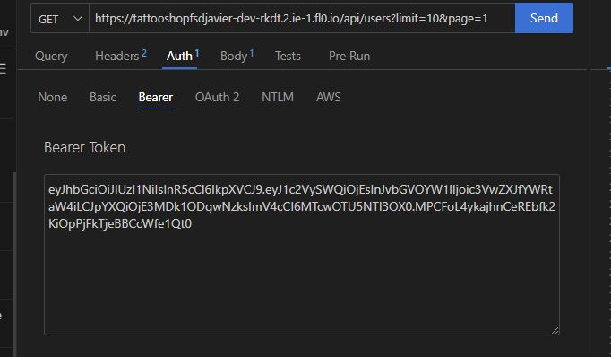
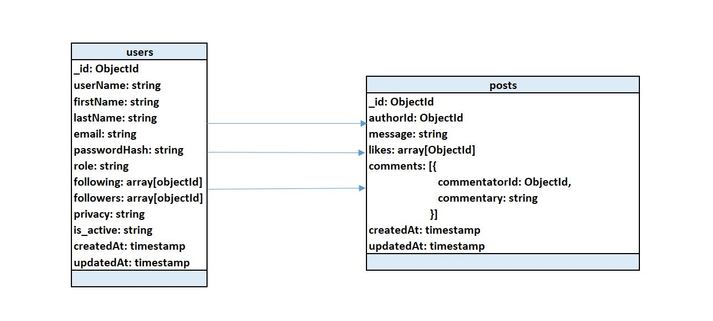

# Welcome to the new geeks Network
This is the fifth project in the Full Stack Developer Bootcamp at GeeksHubs


  ## Content 📝
  <ol>
    <li><a href="#about-the-project">About the project</a></li>
    <li><a href="#stack">Stack</a></li>
    <li><a href="#deploy-🚀">Deploy</a></li>
    <li><a href="#local-installation">Installation</a></li>
    <li><a href="#api-information">API information</a></li>
    <li><a href="#db-diagram">DB diagram</a></li>
    <li><a href="#db-relations">DB relations</a></li>
    <li><a href="#endpoints">Endpoints</a></li>
    <li><a href="#problems-solutions">Problems solutions</a></li>
    <li><a href="#future-features">Future features</a></li>
    <li><a href="#development">Development</a></li>
    <li><a href="#contact">Contact</a></li>
  </ol>


## About the project

Create a web app to create a social network. This project requires a functional API connected to a Mongo database.

You can register and login and after that you can start sending messages. You must be logged to see and searchs others users and posts. It is possible to make your profile private so only people that you follow can see your profile or what you post.

There is the possibility to write comments on other posts or to like them. And, if you can follow an user so that if he/she posts another message you can see it on your timeline.

If you want to delete your account, there is the possibility to deactivate your account. Than way your profile and your posts will dissapear from the searchings. If you want to delete completely your account you have to contact a super admin and he/she will procceed after you have deactivated your account.


## Stack

<div align="center">
<a href="https://www.expressjs.com/">
    
</a>
<a href="https://nodejs.org/es/">
    
</a>
<a href="https://developer.mozilla.org/es/docs/Web/JavaScript">
    
</a>
<a href="">

</a>
<a href="">
    
</a>
<a href="">
    
</a>
<a href="">
    
</a>
<a href="">
    
</a>
 </div>

## Deploy 🚀
<div align="center">
    <a href="https://socialnetwork-dev-stbs.2.ie-1.fl0.io"><strong>https://socialnetwork-dev-stbs.2.ie-1.fl0.io</strong></a>🚀🚀🚀
</div>


## Local installation

1. If you don't have MongoDB installed on you computer, you can install Docker and execute the above command on your Powershell to create a MongoDB container
` $ docker run -d -p 27017:27017 --name mongo -v mongo_data:/data/db -e MONGO_INITDB_ROOT_USERNAME=root -e MONGO_INITDB_ROOT_PASSWORD=root mongo:latest `
2. Clone the repository
` $ git clone https://github.com/Javi-Gallego/FSD_Proyecto5.git `
3. Install dependencies
` $ npm install `
4. Run server
` $ npm run dev `
5. Mock DB with seeders
` $ npm run seeds `

## API information
<details>
<summary>Work in local</summary>
The repository has a .env_local_sample. You have to change its name to .env to work properly

In the HTTP directory there is a file named social_network_local.json, you can open it with 'Thunder Client' to have all the endpoints of the API. For the endpoints examples below I will use the deployed url. In the tattoo_shop_local.json you have the url with your localhost.

If you will use the API in local, you need a connection to a DB and put the credentials in the .env as needed. These credentials will be in the .env_local_sample and will work with the docker container exposed in point 1 of the local installation.
</details>

<details>
<summary>Work with deployed server</summary>
The repository has a .env_deploy_sample. You have to change its name to .env to work properly.

In the HTTP directory theres a file named tattoo_shop_deployed.json, you can open it with 'Thunder Client' to have all the endpoints of the API.
</details>

<details>
<summary>Authentication</summary>
When an endpoint needs authentication you must put the token given to you when you login in the Bearer Token field in "Auth". In the login endpoint I will put the super_admin email and password.

 

 For a fast comprehension we will use icons to show what is needed to see the endpoints:
 :angel: You must be logged as super_admin
 :man: You must be logged
 :earth_africa: This endpoint is global and can be viewed by everybody
 :lock: You can enter this endpoint if you are authenticated. If you are a user you can only search, update or retrieve your own things, if you are a super_admin you can change or retrieve all the records of the database.
</details>

## DB diagram


## DB relations
    
    - Although MongoDB is a non relational database, we make various references between our two collections.

    - The values of the authorId, likes, and commentatorId fields of the Post entitie are of type ObjectId generated in Users.

    - Users also has auto-relations because following and followers are arrays that cointains ObjectId and they have to be ids of actual Users.

## Endpoints

<details>
<summary>Endpoints</summary>


- AUTH
    - REGISTER :earth_africa:

            POST https://socialnetwork-dev-stbs.2.ie-1.fl0.io/api/auth/register
        body:
        ``` js
            {
                {
                    "userName": "Tee",
                    "email": "remoto@gmail.com",
                    "password": "123456"
                }
            }
        ```

    - LOGIN :earth_africa:

            POST https://socialnetwork-dev-stbs.2.ie-1.fl0.io/api/auth/login 
        body:
        ``` js
            {
                "email": "super_admin@gmail.com",
                "password": "123456"
            }
        ```
        This will be needed to obtain a token with super_admin credentials
        body:
        ``` js
            {
                "email": "user@gmail.com",
                "password": "123456"
            }
        ```
        This will be needed to obtain a token with user credentials
- USERS
    - PROFILE :lock:

            GET https://socialnetwork-dev-stbs.2.ie-1.fl0.io/api/users/profile

        You must be logged in and you will see the profile of the user authenticated.   

    - UPDATE PROFILE :lock:

            PUT https://socialnetwork-dev-stbs.2.ie-1.fl0.io/api/users?limit=10&page=1
            body:
        ``` js
            {
                {
                    "userName": "La Bruja Lola",
                    "firstName": "Lola",
                    "lastName": "Fernandez",
                    "email": "labrujalola@gmail.com",
                    "currentPassword": "123456",
                    "newPassword": "123456",
                    "privacy": "private"
                }
            }
        ```
        You must be logged because it will update the profile based on the id that is encrypted in the token. You can change any of the fields that are showed in the example and it has same validations as in the registration.
        If you want to change your password you must put your current password and the new password.
        Privacy can be private or public, if you put your profile as public your post can be searched by every user, if it is private only people that is in your following list can see you.
        Fields that want to be updated must be named in the body as in the example.   

    - GET USERS :angel:

            GET https://socialnetwork-dev-stbs.2.ie-1.fl0.io/api/users?limit=10&page=1
            body:
        ``` js
            {
                {
                    "name": "Javi",
                    "email": "ja",
                    "firstName": "",
                    "lastName": "",
                    "role": "",
                    "limit": 3,
                    "skip": 0
                }
            }
        ```
        This endponint has the params "limit" and "skip" to do a pagination of the users retrieved as a result. "limit" is the number of records shown each time. If there are more registres than the limit they are shown in next pages with "skip". By default, limit is 10 and skip 0.
        
        There are two ways to get users, as super_admin or as a normal user.

        If your are logged as super_admin and you don't have any value in the body it will show every user in the database but you can put some entries that will work as filters, they are optional to put and the value does not need to be exactly the same as in the database ie: if you search "Ja" as name it will retrieve every user thas has the string "Ja" in its user name. You can put as much filters as you want.

        If you are logged as a normal user you can only search the field user name and it will be automatically filtered to retrieve only users that have their profile as public, that are active and that have the role user. Even if you send other fields the api will discard them and only search by user name (in the body named as "name")

    - UPDATE USER ROLE :angel:

            PUT hhttps://socialnetwork-dev-stbs.2.ie-1.fl0.io/api/users/65edca96352c4f2a5cf087d3/role
        body:
        ``` js
            {
                "userRole": "admin"
            }
        ```
        You must be logged as super_admin. In the url we pass the user id as a parameter and we should send the new role of that user in the body. 

        The only values accepted are: "admin" or "user"

    - FOLLOW USER :lock:

            PUT https://socialnetwork-dev-stbs.2.ie-1.fl0.io/api/users/deactivate
        body:
        ``` js
            {
            
            }
        ```
        You must be logged and pass the id of the user you want to follow as parameter. This endpoint will put the selected user in you following array and also put your id in the users followers array.

    - DEACTIVATE USER :lock:

            PUT https://socialnetwork-dev-stbs.2.ie-1.fl0.io/api/users/deactivate
        body:
        ``` js
            {
            
            }
        ```
        You must be logged and the account will be inactive. This way you will not appear in searchs but your data will be kept in the DB

    - REACTIVATE USER :angel:

            PUT https://socialnetwork-dev-stbs.2.ie-1.fl0.io/api/users/superactivation/65edca96352c4f2a5cf087d3
        body:
        ``` js
            {

            }
        ```
        You must be logged as super_admin. If an account is deactivated it will be activated again. If the account is deleted there is no way to recover the account.

    - DELETE USER :angel:

            DELETE https://socialnetwork-dev-stbs.2.ie-1.fl0.io/api/users
        body:
        ``` js
            {
                
            }
        ```
        You must be logged as super_admin. Only an account that is already inactive can be deleted. 

- POSTS
    - CREATE POST :lock:

            POST https://socialnetwork-dev-stbs.2.ie-1.fl0.io/api/posts
            query examples:
        ``` js
            {
                "message": "Este será un gran post de prueba"
            }
        ```

        Authentication needed. You need to send the content of the post as a "message" in the body.

    - DELETE POST :angel: 

    
            DELETE  https://socialnetwork-dev-stbs.2.ie-1.fl0.io/api/posts/65f888aaf5d72a527e071067
            body:
        ``` js
            {
                
            }
        ```
        You must be logged to delete a post and you must be either the author or a super_admin. The id of the post must be send as parameter in the url
    - UPDATE POST :lock:

            PUT  https://socialnetwork-dev-stbs.2.ie-1.fl0.io/api/posts
            body:
        ``` js
            {
                "postId": "65f88e62e2b18a183f5e37e9",
                "message": "Esto está actualizado"
            }
        ```
        You must be logged to delete a post and you must be either the author or a super_admin. To update, in the body you must send the postid and the new message as in the example

    - GET OWN POSTS :lock: 

            GET  https://socialnetwork-dev-stbs.2.ie-1.fl0.io/api/posts/own

        You must be logged and it will retrieve all the post written by you

    - GET ALL POSTS :angel: 

            GET  https://socialnetwork-dev-stbs.2.ie-1.fl0.io/api/posts/own

        You must be logged and it will retrieve all the posts

    - LIKE POST :lock: 

            PUT  https://socialnetwork-dev-stbs.2.ie-1.fl0.io/api/posts/like/65f35ea33fa5deabe201709b

        You must be logged give the id of the post as a parameter in the url. If you already like the post, you will automatically unlike if you try one more time.
    
    - GET TIMELINE :lock: 

            GET  https://socialnetwork-dev-stbs.2.ie-1.fl0.io/api/posts/timeline

        You must be logged it will retrieve all the post written by the people you are following

    - ADD A COMMENT TO A POST :lock: 

            PUT  https://socialnetwork-dev-stbs.2.ie-1.fl0.io/api/posts/comment/65edcb67352c4f2a5cf087e3
            body:
        ``` js
            {
                "message": "Esto está actualizado"
            }
        ```
        You must be logged it will retrieve all the post written by the people you are following
</details>

## Problems solutions
I could not erase fields that were already written.

If we update an appointment of a service that has tattoo artist and a tattoo image from the catalog and change that appointment to do a piercing, the obvious thing is to change the service_id and delete the artist_id and tattoo_id that are no longer needed, but I could not do that.

I thought of an internal convention to change the artist_id to one named "worker" that points to a king of default worker and to a tattoo_id that points to a tattoo named "no tattoo selected".

## Future features
[ ] Tattoo artists can also make and update appointments on their own.
[ ] Add reviews to the artists based on user experiences
[ ] Add a rating system to the catalog and filter or order based on this rating.
[ ] Maybe, to buy a piercing you do not need to make an appointment, just go to the shop. So you can see the service but cannot make an appointment with that service.
[ ] Add piercings images to the catalog.
[ ] Add role for piercing artists if they are different from the tattoo ones, add another role for the artists than can do both.
[ ] Add a frontend so the users can interact with the API.

## Development:

``` js
 const developer = "Javier Gallego";

 console.log("Desarrollado por: " + developer);
```  

## Contact
<div align="center">
<a href = "mailto:galgar@gmail.com"></a>
<a href="https://www.linkedin.com/in/javier-gallego-dev"></a>
<a href="https://github.com/Javi-Gallego"></a>
</div>